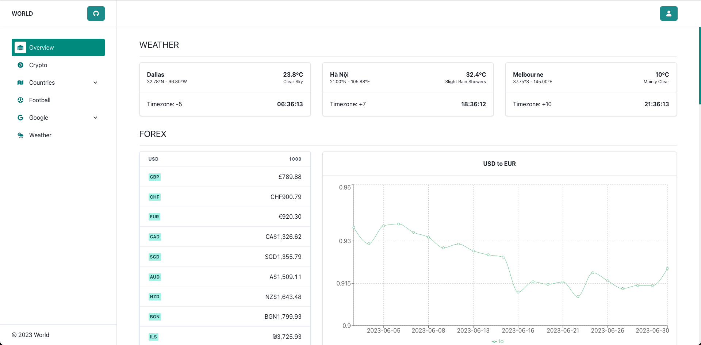

<div align="center">
  <h1 align="center">🌎 Prime Earth 🌎</h1>
  <h3>FOSS for World Analytics</h3>
</div>

<div align="center">
  <a href="https://dashboardworldweb.vercel.app">world.app</a>
</div>

<div align="center">
    <a href="https://github.com/hieudoanm/app.world/stargazers">
        
    </a>
    <a href="https://github.com/hieudoanm/app.world/issues">
        
    </a>
    <a href="https://github.com/hieudoanm/app.world/blob/master/LICENSE">
        
    </a>
    <a href="https://twitter.com/hieudoanm">
        
    </a>
</div>

<br/>

Prime Earth is a FOSS (Free Open Source Software) for World Analytics. Built with [Auth0](https://auth0.com/), [Supabase](https://supabase.com) and [Vercel](https://vercel.com/).

## Table of Content

- [Table of Content](#table-of-content)
- [Features](#features)
- [Demo](#demo)
- [Techstack](#techstack)
  - [Language](#language)
  - [Development](#development)
  - [Front-end](#front-end)
  - [Back-end](#back-end)
    - [Framework](#framework)
    - [Documentation](#documentation)
    - [Database](#database)
  - [Testing](#testing)
  - [DevOps](#devops)
    - [SaaS](#saas)
  - [APIs](#apis)
- [Getting Started](#getting-started)
  - [Prerequisites](#prerequisites)
    - [1. Clone the repository](#1-clone-the-repository)
    - [2. Install Dependencies](#2-install-dependencies)
    - [3. Copy the environment variables to `.env`](#3-copy-the-environment-variables-to-env)
    - [4. Configure the variables in `.env`](#4-configure-the-variables-in-env)
    - [5. Start Database](#5-start-database)
    - [6. Initialize the database](#6-initialize-the-database)
    - [7. Run the API](#7-run-the-api)
    - [8. Run the Web](#8-run-the-web)
  - [Contributing](#contributing)
  - [Our Contributors ✨](#our-contributors-)
  - [Inspiration](#inspiration)

## Features

- Countries
- (Google) Trends
- (Google) YouTube
- News

## Demo

- [API](https://dashboardworldapi.vercel.app/)
- [API](https://dashboardworldweb.vercel.app/)



## Techstack

### Language

- [x] [typescript](https://www.typescriptlang.org/)

### Development

- [x] Build: [webpack](https://webpack.js.org/)
- [x] Formatting: [prettier](https://prettier.io/)
- [x] Hooks: [husky](https://typicode.github.io/husky/)
- [x] Linting: [eslint](https://eslint.org/)
- [x] Logging: [pino](https://getpino.io/)

### Front-end

- [x] JS Framework: [next.js](https://nextjs.org/)
- [x] CSS Library: [tailwindcss](https://tailwindcss.com/)
- [x] CSS Framework: [chakra-ui](https://chakra-ui.com/)

### Back-end

- [x] Runtime: [node.js](https://nodejs.org/en)

#### Framework

- [x] [express.js](https://expressjs.com/)
- [x] [apollo-graphql](https://www.apollographql.com/)

#### Documentation

- [x] [redocly](https://redocly.com/)
- [x] [tsoa](https://tsoa-community.github.io/docs/)

#### Database

- [x] [PostgreSQL](https://www.postgresql.org/)
- [x] [Prisma](https://www.prisma.io/)
  - [x] [Generators](https://www.prisma.io/docs/concepts/components/prisma-schema/generators)
    - [x] [prisma-client-js](https://www.prisma.io/docs/concepts/components/prisma-client)
    - [x] [prisma-dbml-generator](https://github.com/notiz-dev/prisma-dbml-generator) - [dbdiagram](https://dbdiagram.io)
    - [x] [prisma-docs-generator](https://github.com/pantharshit00/prisma-docs-generator)
    - [x] [prisma-json-schema-generator](https://github.com/valentinpalkovic/prisma-json-schema-generator)

### Testing

- [x] [jest.js](https://jestjs.io/)

### DevOps

- [x] CI/CD: [GitHub Actions](https://github.com/features/actions)
- [x] Hosting: [Vercel](https://vercel.com/)

#### SaaS

- [x] [Auth0](https://auth0.com)
- [x] [Supabase](https://supabase.com)

### APIs

- [REST Countries](https://restcountries.com/)
- [Coinranking](https://developers.coinranking.com/api/documentation)
- Currencies
  - [Fixer](https://fixer.io/)
  - [Frankfurter](https://www.frankfurter.app/)
- [Google Trends](https://trends.google.com/trends/hottrends/visualize?nrow=5&ncol=5)
- [News](https://newsapi.org/)
- [Passport Index](https://www.passportindex.org/)
- [WorldTimeAPI](https://worldtimeapi.org/)
- Weather
  - [OpenWeatherMap](https://openweathermap.org/)
  - [Weatherbit](https://www.weatherbit.io/)

## Getting Started

### Prerequisites

Here's what you need to be able to run USA:

- Node.js (version >= 18)
- PostgreSQL (I am using Supabase)

#### 1. Clone the repository

```shell
git clone https://github.com/hieudoanm/app.world.git
cd app.world
```

#### 2. Install Dependencies

```shell
yarn install
```

#### 3. Copy the environment variables to `.env`

```shell
cp .env.example .env
```

#### 4. Configure the variables in `.env`

| Variable              | Value                                                         |
| --------------------- | ------------------------------------------------------------- |
| AUTH0_SECRET          | `openssl rand -hex 32`                                        |
| AUTH0_BASE_URL        | `http://localhost:3000`                                       |
| AUTH0_ISSUER_BASE_URL | `https://<tenant>.<region>.auth0.com`                         |
| AUTH0_CLIENT_ID       | `auth_client_id`                                              |
| AUTH0_CLIENT_SECRET   | `auth_client_secret`                                          |
| POSTGRESQL_URL        | `postgresql://<username>:<password>@<host>:<port>/<database>` |

#### 5. Start Database

```shell
docker-compose up -d
```

#### 6. Initialize the database

```shell
yarn prisma:dev
```

#### 7. Run the API

```shell
yarn dev:api
```

#### 8. Run the Web

```shell
yarn dev:web
```

Visit [http://localhost:3000](http://localhost:3000) in your browser.

### Contributing

USA Analytics is a FOSS project and we welcome contributions from the community.

If you'd like to contribute, please fork the repository and make changes as you'd like. Pull requests are warmly welcome.

### Our Contributors ✨

<a href="https://github.com/hieudoanm/app.world/graphs/contributors">
  
</a>

### Inspiration

- [worldbank](https://www.worldbank.org/)
